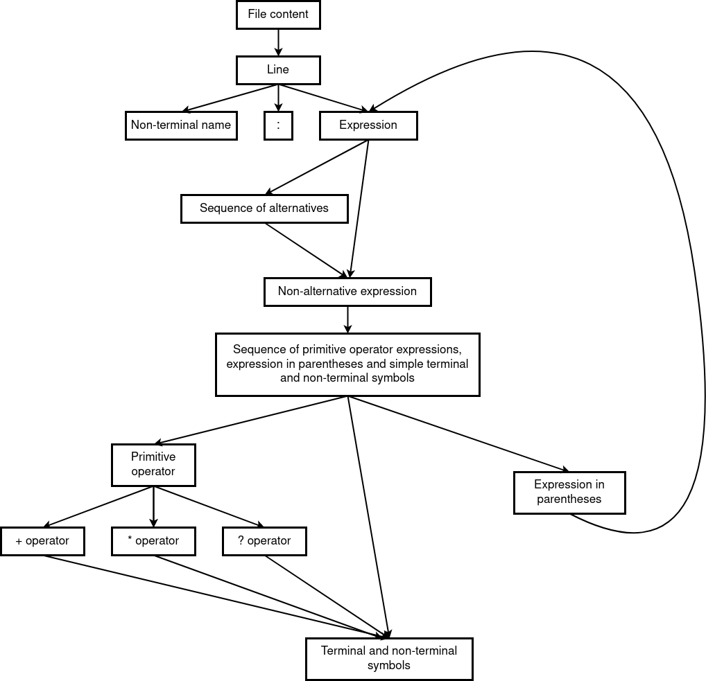

# Automata for EBNF

## File syntax

File should consist of lines of comments or rules.

### Rule line

Rule line has the following format:
```
<non-terminal name> : <expression>
```

Where:
* `<non-terminal name>` - is sequence of capital letters
* `<expression>` - is regex expression, with following operators supported:
  * `*` - zero or more repetitions
  * `?` - zero or one appearance
  * `|` - alternatives
  * `(<expression>)` - expression in parenthesis

#### Expression syntax

1. `<expression>` is sequence of alternatives:

    ```
    <non-alternative expression> | <non-alternative expression> | ...
    ```

2. Each `<non-alternative expression>` is a concatenation of `<operator expression>`'s
and `<simple expression>`'s.

    Example:
    ```
    <simple expression> <simple expression> <operator expression> ...
    ```

3. `<simple expression>` correspond to `<non-terminal name>` or `<terminal expression>`

4. `<terminal expression>` is sequence of arbitrary ASCII symbols placed in double quotes.

    Example:
    ```
    S : "some string"
    ```

5. `<operator expression>` correspond to either star (`*`) or maybe (`?`) operators.

    These operators act on the left and can be applied to:

   * `<CAPITAL LETTER>` (this case corresponds to operator applied to a single letter non-terminal name).
   
     For example: `A*`

   * Expression in parentheses.
   
     For example: `(AB)*`
   * `<terminal expression>` in quotes.
   
     For example: `"cats"*` - star is applied to the whole string.

  
#### Notes:

1. Double quotes inside string should be marked with escaped symbol: `"\""`.
2. Spaces outside double quotes are ignored.
3. Spaces inside double quotes are considered as part of the terminal expression.

### Comment line

Comment line starts with `//` and can contain arbitrary ASCII symbol.

Example:
```
// Comment string
```

## Example of file format

```
S : AB? | (AB)*
A : "abc"
B : A | "abc"?
```

## ANTLR compilation

For obtaining parser and visitor, one should execute following command in the terminal:
```sh
$ cd src
$ antlr4 -Dlanguage=Python3 Automata.g4 -visitor -o antlr_files
```

This command run `antlr4`, which would generate parser and visitor in `antlr_files` folder.
These files can be imported and used in your code.

For example:
```
from antlr4 import *
from antlr_files.AutomataLexer import AutomataLexer
from antlr_files.AutomataParser import AutomataParser
from antlr4.tree.Trees import Trees


def main():
    # Read example file content
    with open("examples/example1.txt", 'r') as file:
        data = file.read()

    data_stream = InputStream(data)
    # lexer
    lexer = AutomataLexer(data_stream)
    stream = CommonTokenStream(lexer)
    # parser
    parser = AutomataParser(stream)
    # Run parser
    tree = parser.s()
    # Print tree
    print(Trees.toStringTree(tree, None, parser))


if __name__ == "__main__":
    main()
```

## Visualization of the syntax:


